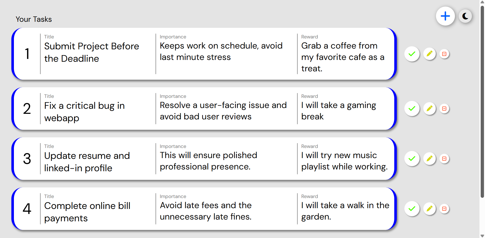
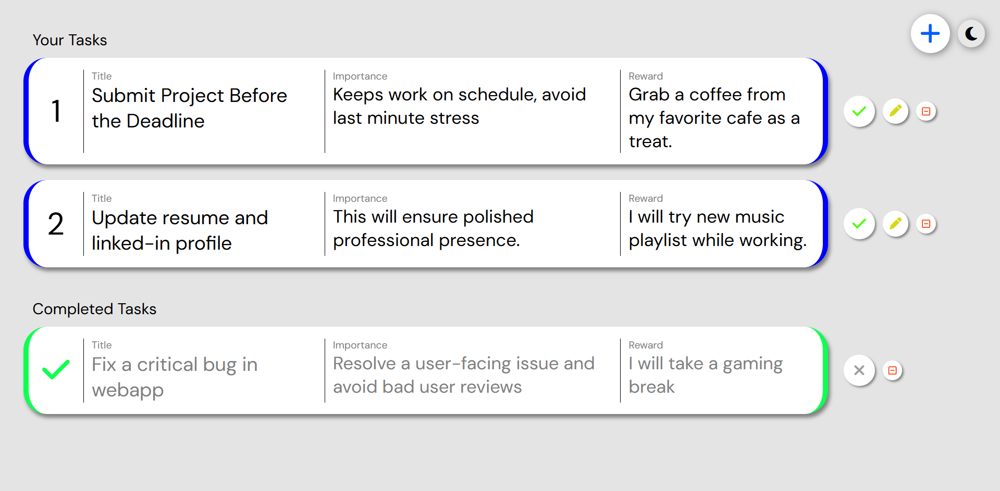
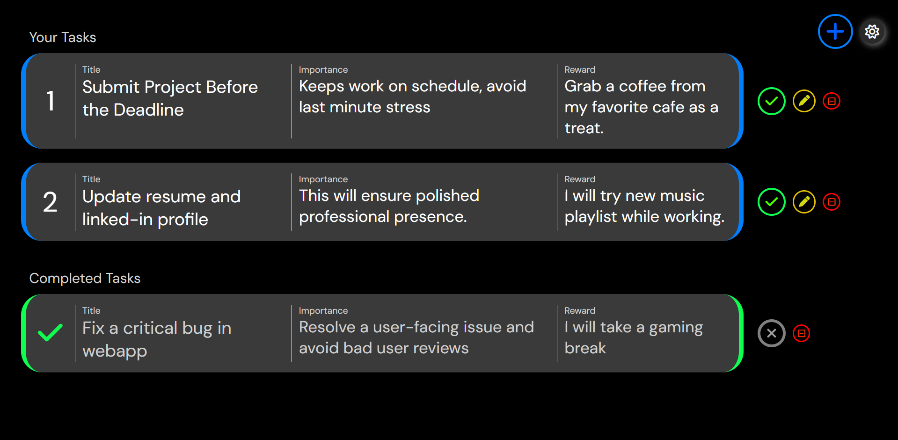
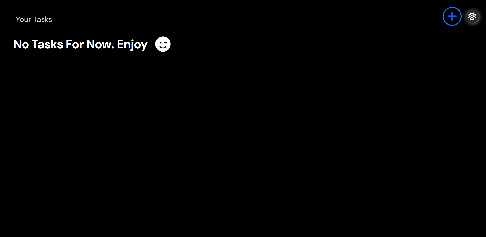

# Your To-Do List 🗂️
***This isn't overloaded with heavy navbars, logos, or headers. Just a focused task interface that gives you clarity — nothing more, nothing less. That will truly remind you the importance of the task.***

A clean, no-fluff to-do list web app built from scratch using **vanilla JavaScript** and **traditional CSS**.  
Made for myself — the kind of simple tool I wanted to actually use daily.

### Live site - [Visit Your To-Do List Webapp](https://your-to-list-app.netlify.app/)

---

## 🖼️ Screenshots

    

    <h3>Light Mode – 4 Tasks</h3>
    
    

    

    <h3>Light Mode – Mixed States</h3>
    
    

    

    <h3>Dark Mode – Mixed States</h3>
    
    

    

    <h3>Dark Empty - No Tasks</h3>
    
    

---

## ✨ Features

- ✅ Add, complete, and remove tasks
- 📌 Pin tasks to stay on top
- 🌙 Light & Dark mode toggle
- 📱 Responsive design (best on tablets and desktops — still improving mobile!)

---

## 📱 Mobile Note

I’ve done my best to make it responsive, but mobile is still a work in progress.  
If anything looks off there, please forgive it — I’m learning and improving it actively.

---

## 🌈 Design Philosophy

- Minimal spacing for a focused view
- No distractions — it’s *your* to-do list, not mine
- Light and dark themes to suit your mood

---

## 🧪 Tech Used

- Vanilla JavaScript (no frameworks)
- HTML5 + CSS3 (media queries for responsiveness)
- Pure browser storage (no backend)

---

## 🙌 Final Words

This is a small project, but 100% built with care and curiosity.  
If it helps you stay organized even a little — that means a lot.

Thanks for checking it out. ✌️
